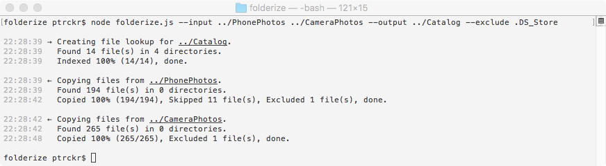

# folderize

The folderize utility copies files from multiple sources into a single destination folder.&nbsp;&nbsp;In the destination folder the files are sorted in a folder tree created by their last modification time (`mtime`).



## Synopsis

<pre><b>folderize</b> [<b>-n</b>] <b>--input</b> <ins>PATH</ins> <ins>...</ins> [<b>--output</b> <ins>PATH</ins>] [<b>--locale</b> <ins>LOCALE</ins>] [<b>--exclude</b> <ins>GLOB</ins> <ins>...</ins>]</pre>

## Options

<div><code><b>--input</b>, <b>-i</b> <ins>PATH</ins> <ins>...</ins></code></div>
<dl><dd>The input folder(s).</dd></dl>

<div><code><b>--output</b>, <b>-o</b> <ins>PATH</ins></code></div>
<dl><dd>The destination folder.&nbsp;&nbsp;The current folder (./) is used as default.</dd></dl>

<div><code><b>--locale</b>, <b>-l</b> <ins>LOCALE</ins></code></div>
<dl><dd>The locale to be used for folder creation in the destination folder.&nbsp;&nbsp;Locales other than english need at least node v.13 or node build with full-icu.&nbsp;&nbsp;The default is en−US.</pre></dd></dl>

<div><code><b>--exclude</b>, <b>-e</b> <ins>GLOB</ins> <ins>...</ins></code></div>
<dl><dd>The files and/or folders names which shall not be copied.&nbsp;&nbsp;Supported glob patterns are * and ?.&nbsp;&nbsp;`*' will match dotfiles.</pre></dd></dl>

<div><code><b>--nocache</b>, <b>-n</b></code></div>
<dl><dd>Disables the creation/use of the cache file `folderize.cache'. The file index will be rebuild from scratch.</dd></dl>

## Tests

Test are written to be run with [mocha](https://mochajs.org).&nbsp;&nbsp;Test coverage is basically non-existent at the moment though and more tests need to be added in the future.

```sh
npm install mocha
./node_modules/mocha/bin/mocha
```